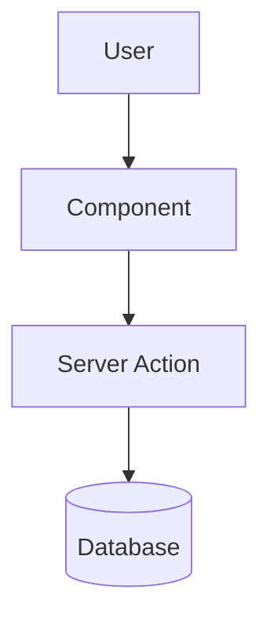

# [Feature Name] Implementation Plan

> **Status:** Draft | In Review | Approved | In Progress | Completed
> **Created:** YYYY-MM-DD
> **Author:** [Name]

---

## 1. Requirements

### 1.1 Problem Statement
_What problem are we solving? Who experiences this problem?_

### 1.2 User Stories
_As a [role], I want [capability] so that [benefit]._

- [ ] As a _____, I want _____ so that _____
- [ ] As a _____, I want _____ so that _____

### 1.3 Acceptance Criteria
_How do we know when this is done?_

- [ ] Criterion 1
- [ ] Criterion 2

### 1.4 Out of Scope
_What are we explicitly NOT doing?_

- Item 1
- Item 2

### 1.5 Open Questions
_Decisions that need user input before implementation._

| Question | Answer | Decided By |
|----------|--------|------------|
| ? | | |

---

## 2. Technical Design

### 2.1 Approach
_High-level technical approach. Why this solution over alternatives?_

### 2.2 Database Changes
_New tables, columns, migrations needed._

```sql
-- Migration: YYYYMMDD_feature_name.sql
```

### 2.3 API/Server Actions
_New endpoints or server actions._

| Action | Purpose |
|--------|---------|
| `actionName` | Description |

### 2.4 UI Components
_New components or pages._

| Component | Location | Purpose |
|-----------|----------|---------|
| `ComponentName` | `src/components/...` | Description |

### 2.5 Architecture Diagram
_Use mermaid for visual architecture._



---

## 3. Implementation Tasks

**Task Numbering:** `{Phase}.{Section}.{Task}` (e.g., 0.1.1, 1.2.3)
- Phase 0 = Foundation (migrations, types, setup)
- Phase 1+ = Feature phases
- Use `/execute` to run tasks systematically

### Phase 0: Foundation

#### 0.1 Database Setup
- [ ] **0.1.1** Create database migration
  - Files: `supabase/migrations/YYYYMMDD_*.sql`
  - Test: Migration applies successfully

- [ ] **0.1.2** Generate TypeScript types
  - Files: `src/types/database.ts`
  - Test: Types compile without errors

#### 0.2 Core Types
- [ ] **0.2.1** Create feature types/interfaces
  - Files: `src/types/*.ts`
  - Test: Types used in subsequent tasks

---

### Phase 1: Core Features

#### 1.1 Section Name
- [ ] **1.1.1** Task description
  - Files: `path/to/file.ts`
  - Test: How to verify

- [ ] **1.1.2** Another task
  - Files: `path/to/file.ts`
  - Test: How to verify

#### 1.2 Another Section
- [ ] **1.2.1** Task description
  - Files: `path/to/file.ts`
  - Test: How to verify

---

<!-- MVP BOUNDARY - Everything above is required for MVP -->

### Phase 2: Enhancements (Post-MVP)

#### 2.1 Section Name
- [ ] **2.1.1** Enhancement task
  - Files: `path/to/file.ts`
  - Test: How to verify

---

## 4. Files to Create/Modify

### New Files
| File | Purpose |
|------|---------|
| `path/to/file.ts` | Description |

### Modified Files
| File | Changes |
|------|---------|
| `path/to/existing.ts` | What changes |

---

## 5. Testing Strategy

### Unit Tests
- [ ] Test case 1
- [ ] Test case 2

### Integration Tests
- [ ] Test flow 1

### Manual Testing
- [ ] Scenario 1

---

## 6. Rollout Plan

### Dependencies
_What needs to happen before this can be deployed?_

### Migration Steps
_Database migrations, environment variables, etc._

### Verification
_How to verify the feature works in production._

---

## 7. Progress Summary

| Phase | Total | Complete | Status |
|-------|-------|----------|--------|
| Phase 0 | 0 | 0 | ⬜ Not Started |
| Phase 1 | 0 | 0 | ⬜ Not Started |
| Phase 2 | 0 | 0 | ⬜ Not Started |

---

## 8. Task Log

| Task | Date | Commit | Notes |
|------|------|--------|-------|
| | | | |

---

## Approval

- [ ] Requirements reviewed by: _____
- [ ] Technical design reviewed by: _____
- [ ] Ready for implementation
