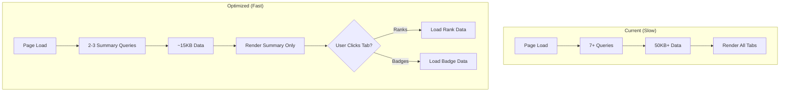

# Advancement Page Performance Optimization Plan

> **Status:** Draft
> **Created:** 2026-01-23
> **Author:** Claude

---

## 1. Requirements

### 1.1 Problem Statement

The `/advancement` page is the heaviest page in the application, loading excessive data that causes slow page loads:
- 7+ sequential database queries
- 50KB+ of data sent to client
- ALL rank requirements loaded (1000+) when only ~10 needed for display
- ALL 141 merit badges fetched to extract category names
- Map objects passed in props (can't serialize to JSON)
- No lazy loading - both rank and badge browsers load immediately

Leaders with large units (50+ scouts) experience noticeable delays loading this page.

### 1.2 User Stories

- [x] As a **leader**, I want the advancement page to load quickly so that I can efficiently manage scout progress
- [x] As an **admin**, I want Vercel Analytics enabled so that I can monitor real-world performance metrics

### 1.3 Acceptance Criteria

- [ ] Advancement page initial load transfers < 20KB of data (down from 50KB+)
- [ ] Server queries reduced from 7+ to 3-4 optimized queries
- [ ] Rank requirements filtered server-side (only current version loaded)
- [ ] Merit badge categories fetched separately, not all 141 badges
- [ ] Tab content lazy loaded (rank/badge browsers load on click)
- [ ] Vercel Analytics reporting Web Vitals metrics
- [ ] No visual/functional regressions

### 1.4 Out of Scope

- Other pages (scout profile, roster, finances) - future optimization
- Database schema changes or new indexes
- Client-side state management changes (beyond fixing Map serialization)
- Pagination/infinite scroll (using filtering approach instead)

### 1.5 Open Questions

| Question | Answer | Decided By |
|----------|--------|------------|
| Focus scope? | Advancement page only | User |
| Data strategy? | Server-side filtering | User |
| Monitoring? | Vercel Analytics | User |

---

## 2. Technical Design

### 2.1 Approach

**Strategy: Server-side filtering + Lazy loading tabs**

1. **Reduce data fetched**: Filter queries server-side to only return needed data
2. **Lazy load tabs**: Only load rank/badge browser data when user clicks those tabs
3. **Fix serialization**: Replace Map objects with plain objects for props
4. **Add analytics**: Integrate Vercel Analytics for Web Vitals tracking

**Why this approach?**
- Server-side filtering is most impactful - prevents unnecessary data transfer
- Lazy loading tabs reduces initial payload without changing UX
- No database schema changes needed - pure application-level optimization
- Vercel Analytics is free tier and integrates seamlessly with Next.js

### 2.2 Database Changes

None required. Using existing indexes:
- `idx_scout_rank_progress_scout` - rank progress by scout
- `idx_scout_mb_progress_scout` - merit badge progress by scout
- `idx_rank_requirements_rank_version` - rank requirements by version (currently unused)

### 2.3 API/Server Actions

| Action | Purpose |
|--------|---------|
| `getUnitAdvancementSummary()` | New: Optimized summary stats query |
| `getRankRequirementsByVersion()` | New: Filter rank reqs by version year |
| `getMeritBadgeCategories()` | New: Just categories, not all badges |
| `getScoutRankProgress()` | Modify: Add optional scout filtering |

### 2.4 UI Components

| Component | Location | Purpose |
|-----------|----------|---------|
| `Analytics` | `src/app/layout.tsx` | Vercel Analytics wrapper |
| `LazyRankBrowser` | `src/components/advancement/` | Lazy-loaded rank browser |
| `LazyMeritBadgeBrowser` | `src/components/advancement/` | Lazy-loaded badge browser |

### 2.5 Architecture Diagram

---

## 3. Implementation Tasks

**Task Numbering:** `{Phase}.{Section}.{Task}` (e.g., 0.1.1, 1.2.3)

### Phase 0: Foundation

#### 0.1 Analytics Setup
- [x] **0.1.1** Install `@vercel/analytics` package
  - Command: `npm install @vercel/analytics`
  - Test: Package in dependencies ✓

- [x] **0.1.2** Add Analytics component to root layout
  - Files: `src/app/layout.tsx`
  - Test: Analytics script loads in browser devtools ✓

#### 0.2 Baseline Measurement
- [x] **0.2.1** Document current page load metrics
  - Measure: Network tab data transfer size
  - Measure: Number of Supabase queries (12 total)
  - Measure: Time to first contentful paint
  - Output: Baseline numbers in this plan ✓

---

### Phase 1: Server-Side Query Optimization

#### 1.1 Summary Stats Optimization
- [x] **1.1.1** Create optimized `getUnitAdvancementSummary()` action
  - Files: `src/app/actions/advancement.ts`
  - Returns: Scout count, in-progress counts, pending approvals count
  - Test: Returns same data as current queries, fewer DB calls ✓

- [x] **1.1.2** Create `getMeritBadgeCategories()` action
  - Files: `src/app/actions/advancement.ts`
  - Returns: Distinct categories only (not all 141 badges)
  - Test: Returns ~10 categories vs 141 badge objects ✓

#### 1.2 Rank Requirements Filtering
- [x] **1.2.1** Create `getRankRequirementsForUnit()` action
  - Files: `src/app/actions/advancement.ts`
  - Filters: By rank_id and version_year (from unit settings or default)
  - Test: Returns ~150 requirements vs 1000+ ✓

- [x] **1.2.2** Update advancement page to use filtered query
  - Files: `src/app/(dashboard)/advancement/page.tsx`
  - Remove: Lines 287-290 that load ALL requirements
  - Test: Same UI behavior, less data transferred ✓

#### 1.3 Fix Map Serialization
- [x] **1.3.1** Replace Map with plain object in props
  - Files: `src/app/(dashboard)/advancement/page.tsx`, `unit-advancement-content.tsx`, `unit-advancement-tabs.tsx`
  - Change: `Map<string, ScoutProgressData>` → `Record<string, ScoutProgressData>`
  - Test: Props serialize correctly, no console warnings ✓

---

### Phase 2: Lazy Loading Tabs

#### 2.1 Create Lazy Components
- [x] **2.1.1** Create lazy-loadable RankBrowser wrapper
  - Files: `src/components/advancement/lazy-rank-browser.tsx`
  - Pattern: Client component with optional prefetched data
  - Test: Component loads instantly with prefetched data ✓

- [x] **2.1.2** Create lazy-loadable MeritBadgeBrowser wrapper
  - Files: `src/components/advancement/lazy-merit-badge-browser.tsx`
  - Pattern: Client component that fetches on mount
  - Test: Component loads only when tab clicked ✓

#### 2.2 Integrate Lazy Loading
- [x] **2.2.1** Update UnitAdvancementTabs to use lazy components
  - Files: `src/components/advancement/unit-advancement-tabs.tsx`
  - Change: Ranks prefetched server-side, Merit Badges lazy loaded
  - Test: Ranks tab instant, Merit Badges loads on click ✓

- [x] **2.2.2** Add loading states for lazy tabs
  - Files: `src/components/advancement/lazy-rank-browser.tsx`, `lazy-merit-badge-browser.tsx`
  - Add: Skeleton loaders during tab content load
  - Test: Smooth transition when switching tabs ✓

---

<!-- MVP BOUNDARY - Everything above is required for MVP -->

### Phase 3: Advanced Optimization (Post-MVP)

#### 3.1 Data Fetching Improvements
- [ ] **3.1.1** Implement React cache() for deduplication
  - Files: `src/app/actions/advancement.ts`
  - Pattern: Wrap queries with cache() for request deduplication
  - Test: Same data fetched once per request

- [ ] **3.1.2** Add preload pattern for anticipated data
  - Files: `src/app/(dashboard)/advancement/page.tsx`
  - Pattern: preload() calls for likely next actions
  - Test: Faster subsequent loads

#### 3.2 Further Query Consolidation
- [ ] **3.2.1** Combine scouts + progress into single query
  - Files: `src/app/actions/advancement.ts`
  - Use: Supabase nested selects
  - Test: 1 query instead of 2 for scout data

---

## 4. Files to Create/Modify

### New Files
| File | Purpose |
|------|---------|
| `src/components/advancement/lazy-rank-browser.tsx` | Lazy-loaded rank browser wrapper |
| `src/components/advancement/lazy-merit-badge-browser.tsx` | Lazy-loaded badge browser wrapper |

### Modified Files
| File | Changes |
|------|---------|
| `src/app/layout.tsx` | Add Vercel Analytics component |
| `src/app/actions/advancement.ts` | Add optimized query functions |
| `src/app/(dashboard)/advancement/page.tsx` | Use optimized queries, fix Map serialization |
| `src/components/advancement/unit-advancement-tabs.tsx` | Use lazy-loaded components |

---

## 5. Testing Strategy

### Manual Testing
- [ ] Load advancement page with browser devtools Network tab open
- [ ] Verify data transfer < 20KB on initial load
- [ ] Verify rank/badge browser data loads only when tab clicked
- [ ] Compare visual output before/after (no regressions)
- [ ] Test with 8 test scouts, then extrapolate for larger units

### Performance Verification
- [ ] Before: Document baseline metrics
- [ ] After: Compare metrics to baseline
- [ ] Vercel Analytics: Verify Web Vitals appearing in dashboard

### Regression Testing
- [ ] Advancement summary shows correct counts
- [ ] Rank browser displays all ranks and requirements
- [ ] Merit badge browser shows all categories and badges
- [ ] Sign-off functionality works correctly
- [ ] All existing tests pass: `npm test`

---

## 6. Rollout Plan

### Dependencies
- `@vercel/analytics` package (to be installed)
- Vercel project connected for Analytics (already deployed)

### Migration Steps
1. Install analytics package
2. Deploy with analytics only (Phase 0)
3. Collect baseline metrics for 1 day
4. Deploy query optimizations (Phase 1)
5. Verify improvements in Vercel Analytics
6. Deploy lazy loading (Phase 2)

### Verification
- Check Vercel Analytics dashboard for Web Vitals
- Compare LCP (Largest Contentful Paint) before/after
- Monitor for any error spikes

---

## 7. Progress Summary

| Phase | Total | Complete | Status |
|-------|-------|----------|--------|
| Phase 0 | 3 | 3 | ✅ Complete |
| Phase 1 | 5 | 5 | ✅ Complete |
| Phase 2 | 4 | 4 | ✅ Complete |
| Phase 3 | 3 | 0 | ⬜ Post-MVP (optional) |

---

## 8. Task Log

| Task | Date | Commit | Notes |
|------|------|--------|-------|
| 0.1.1 | 2026-01-23 | 24bf334 | Installed @vercel/analytics@1.6.1 |
| 0.1.2 | 2026-01-23 | 24bf334 | Added Analytics to root layout |
| 0.2.1 | 2026-01-23 | 24bf334 | Documented 12 queries, identified 3 redundant scout queries |
| 1.1.1 | 2026-01-23 | pending | Created getUnitAdvancementSummary() |
| 1.1.2 | 2026-01-23 | pending | Created getMeritBadgeCategories() |
| 1.2.1 | 2026-01-23 | pending | Created getRankRequirementsForUnit() with version filtering |
| 1.2.2 | 2026-01-23 | pending | Refactored page to use optimized queries + parallel fetch |
| 1.3.1 | 2026-01-23 | pending | Changed Map to Record in 3 files |
| 2.1.1 | 2026-01-23 | pending | Created LazyRankBrowser with prefetch support |
| 2.1.2 | 2026-01-23 | pending | Created LazyMeritBadgeBrowser |
| 2.2.1 | 2026-01-23 | pending | Updated tabs to use lazy components with prefetched Ranks |
| 2.2.2 | 2026-01-23 | pending | Added skeleton loaders for lazy tabs |

---

## Baseline Metrics

| Metric | Before | After | Improvement |
|--------|--------|-------|-------------|
| Supabase Queries | 12 (10 effective) | | |
| All Rank Requirements | ~1000+ records | | |
| All Merit Badges | 141 records | | |
| Scouts Queries (redundant) | 3x (lines 50, 293, 377) | | |
| Map Serialization | scoutProgressMap uses Map | | |

### Query Breakdown (Before):
1. `profiles` - user profile (line 21)
2. `unit_memberships` - membership (line 33)
3. `scouts` - all scouts in unit (line 50)
4. `scout_rank_progress` - parallel, rank progress (line 81)
5. `scout_merit_badge_progress` - parallel, badge progress (line 104)
6. `scout_rank_requirement_progress` - parallel, pending (line 110)
7. `scout_merit_badge_progress` - pending badge approvals (line 175)
8. `bsa_ranks` - all ranks (line 279)
9. `bsa_rank_requirements` - **ALL requirements** (line 287) ← PROBLEM
10. `scouts` - with rank progress, redundant (line 293)
11. `bsa_merit_badges` - **ALL badges** (line 370)
12. `scouts` - with badge progress, redundant (line 377)

---

## Approval

- [ ] Requirements reviewed by: _____
- [ ] Technical design reviewed by: _____
- [ ] Ready for implementation
