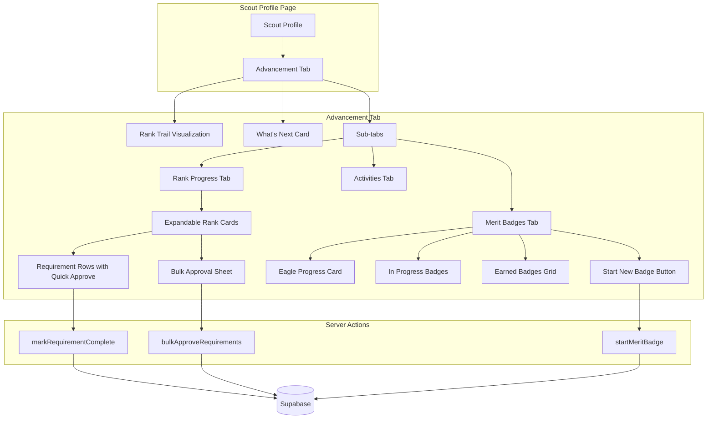

# Scout Profile Advancement UI Enhancement Plan

> **Status:** Draft
> **Created:** 2026-01-20
> **Author:** Claude (Spec-driven planning)

---

## 1. Requirements

### 1.1 Problem Statement

The current scout profile advancement section (feature-flagged) provides basic tracking but lacks visual appeal, ease of use for approvals, and quick visibility into "what's next" for rank advancement. Leaders need a faster way to approve requirements individually or in bulk. Scouts, parents, and leaders need an engaging, mobile-friendly interface that makes advancement tracking feel rewarding.

### 1.2 User Stories

- [x] As a **leader**, I want to quickly approve single or bulk requirements when viewing a rank or merit badge, so that I can efficiently process completions at troop meetings
- [x] As a **scout**, I want to see my progress with visually appealing badge images and clear next steps, so that I feel motivated to advance
- [x] As a **parent**, I want to view my scout's current advancement state and understand what's needed next, so that I can support their progress
- [x] As a **leader**, I want to surface "next steps" without deep navigation, so that I can quickly advise scouts
- [x] As a **scout**, I want to browse available merit badges and start working on them, so that I can take ownership of my advancement
- [x] As a **leader**, I want to import existing advancement data from CSV (Scoutbook export), so that I don't have to re-enter historical data

### 1.3 Acceptance Criteria

- [ ] Scout profile page has an "Advancement" tab with rank progress, merit badges, and activities
- [ ] Rank advancement shows badge images for all 7 ranks with achieved/in-progress states
- [ ] Merit badges display with official-style badge images (or quality placeholders)
- [ ] Eagle-required badges are highlighted with progress toward 14/14 tracked
- [ ] "Next Steps" section shows top 3-5 incomplete requirements for current rank without expanding
- [ ] Single-click requirement approval for leaders viewing any requirement
- [ ] Bulk approval: select multiple requirements and approve with one action
- [ ] Notes field available when approving requirements (date auto-filled)
- [ ] Merit badge browser accessible from scout profile to start new badges
- [ ] CSV import tool for Scoutbook advancement data
- [ ] Mobile-responsive design with touch-friendly interactions
- [ ] Fun, modern visual design that appeals to scouts

### 1.4 Out of Scope

- Parent submission workflow (already designed in existing plan, defer)
- Scoutbook bidirectional sync (just CSV import for now)
- Print checklists (existing plan covers this)
- Counselor management system
- Activity logging UI (keep existing minimal version)

### 1.5 Open Questions

| Question | Answer | Decided By |
|----------|--------|------------|
| Where should advancement UI live? | Tab on scout profile page | User |
| Who can approve requirements? | Leaders only (admin, treasurer, leader roles) | User |
| Can scouts self-start merit badges? | Yes, any badge | User |
| What data stored per requirement? | Date + approver + notes | User |
| Track Eagle path specifically? | Yes, highlight Eagle progress prominently | User |
| Next steps intelligence level? | Simple checklist for current rank | User |
| CSV import needed? | Yes, from Scoutbook | User |

---

## 2. Technical Design

### 2.1 Approach

Enhance the existing `ScoutAdvancementSection` component with:

1. **Visual Redesign**: Replace basic cards with visually engaging rank trail and badge grid
2. **Next Steps Surface**: Add a prominent "What's Next" card showing incomplete requirements
3. **Quick Approvals**: Add single-click and bulk approval functionality
4. **Badge Browser Integration**: Link to merit badge browser for starting new badges
5. **Mobile-First Tabs**: Redesign tabs for touch-friendly mobile use

**Why this approach:**
- Builds on existing schema and server actions (no migrations needed)
- Reuses existing components (RankIcon, MeritBadgeIcon)
- Feature flag already in place for gradual rollout
- Leverages existing `getScoutAdvancementProgress()` data fetching

### 2.2 Database Changes

No new migrations required. Existing schema supports all features:
- `scout_rank_requirement_progress` has `notes`, `completed_at`, `completed_by` fields
- `bsa_ranks` and `bsa_merit_badges` have `image_url` columns
- Status workflow supports approval states

**Optional enhancement (Phase 2):**
```sql
-- Add bulk approval tracking
ALTER TABLE scout_rank_requirement_progress
  ADD COLUMN IF NOT EXISTS bulk_approval_session_id uuid;
```

### 2.3 API/Server Actions

**Existing actions to use:**
| Action | Purpose |
|--------|---------|
| `markRequirementComplete` | Mark single requirement done |
| `approveRank` | Leader approval after completion |
| `awardRank` | Record official award |
| `startMeritBadge` | Begin tracking a badge |

**New actions needed:**
| Action | Purpose |
|--------|---------|
| `bulkApproveRequirements` | Approve multiple requirements at once |
| `addRequirementNotes` | Add/update notes on a requirement |
| `importAdvancementCSV` | Parse and import Scoutbook CSV data |

### 2.4 UI Components

| Component | Location | Purpose |
|-----------|----------|---------|
| `ScoutAdvancementTabs` | `src/components/advancement/` | Redesigned tab container with mobile support |
| `RankTrailVisualization` | `src/components/advancement/` | Visual rank progression (Scout → Eagle) |
| `WhatsNextCard` | `src/components/advancement/` | Prominent next steps display |
| `RequirementApprovalRow` | `src/components/advancement/` | Single requirement with quick approve |
| `BulkApprovalSheet` | `src/components/advancement/` | Multi-select and bulk approve modal |
| `MeritBadgeGridView` | `src/components/advancement/` | Grid of badges with filtering |
| `StartBadgeDialog` | `src/components/advancement/` | Dialog to start tracking a new badge |
| `EagleProgressCard` | `src/components/advancement/` | Eagle-required badge progress tracker |
| `AdvancementImportDialog` | `src/components/advancement/` | CSV import interface |

### 2.5 Architecture Diagram



---

## 3. Implementation Tasks

**Task Numbering:** `{Phase}.{Section}.{Task}` (e.g., 0.1.1, 1.2.3)

### Phase 0: Foundation ✅ COMPLETE

#### 0.1 Server Actions
- [x] **0.1.1** Create `bulkApproveRequirements` server action
  - Files: `src/app/actions/advancement.ts`
  - Test: Can approve 5 requirements in single call, all get same timestamp and approver

- [x] **0.1.2** Create `addRequirementNotes` server action (named `updateRequirementNotes`)
  - Files: `src/app/actions/advancement.ts`
  - Test: Can add/update notes without changing completion status

#### 0.2 Type Definitions
- [x] **0.2.1** Add types for bulk approval and import operations
  - Files: `src/types/advancement.ts` (new file)
  - Test: Types compile and are used in components

---

### Phase 1: Rank Progress Enhancement

#### 1.1 Rank Trail Visualization
- [ ] **1.1.1** Create `RankTrailVisualization` component
  - Files: `src/components/advancement/rank-trail-visualization.tsx`
  - Test: Shows all 7 ranks horizontally, current rank highlighted, earned ranks have checkmarks
  - Design: Trail/path metaphor with rank badges as milestones

- [ ] **1.1.2** Integrate rank trail into advancement section header
  - Files: `src/components/advancement/scout-advancement-section.tsx`
  - Test: Trail appears above tabs, responds to rank changes

#### 1.2 What's Next Card
- [ ] **1.2.1** Create `WhatsNextCard` component showing top incomplete requirements
  - Files: `src/components/advancement/whats-next-card.tsx`
  - Test: Shows 3-5 incomplete requirements from current rank, links to full detail

- [ ] **1.2.2** Add quick-approve button on each "next step" item
  - Files: `src/components/advancement/whats-next-card.tsx`
  - Test: Leaders see approve button, non-leaders see info only

#### 1.3 Enhanced Rank Cards
- [ ] **1.3.1** Redesign `RankProgressCard` with larger badge images and modern styling
  - Files: `src/components/advancement/rank-progress-card.tsx`
  - Test: Card shows rank badge prominently, progress bar is more visual, mobile-friendly

- [ ] **1.3.2** Add notes field when marking requirement complete
  - Files: `src/components/advancement/rank-progress-card.tsx`
  - Test: Leaders can optionally add notes during approval

- [ ] **1.3.3** Create `RequirementApprovalRow` component with quick actions
  - Files: `src/components/advancement/requirement-approval-row.tsx`
  - Test: Single-click approve, shows date/approver on completed items

#### 1.4 Bulk Approval
- [ ] **1.4.1** Create `BulkApprovalSheet` component
  - Files: `src/components/advancement/bulk-approval-sheet.tsx`
  - Test: Can select multiple requirements, set date, add notes, approve all

- [ ] **1.4.2** Add bulk approval trigger to rank card header
  - Files: `src/components/advancement/rank-progress-card.tsx`
  - Test: "Select & Approve" button opens sheet when requirements available

---

### Phase 2: Merit Badge Enhancement

#### 2.1 Eagle Progress Tracking
- [ ] **2.1.1** Create `EagleProgressCard` component
  - Files: `src/components/advancement/eagle-progress-card.tsx`
  - Test: Shows X/14 Eagle-required badges earned, grid of 14 badges with status

- [ ] **2.1.2** Highlight Eagle-required badges throughout UI
  - Files: Various components
  - Test: Eagle badges have distinctive amber/gold styling

#### 2.2 Badge Grid View
- [ ] **2.2.1** Create `MeritBadgeGridView` component with filtering
  - Files: `src/components/advancement/merit-badge-grid-view.tsx`
  - Test: Grid shows all badges, filterable by: In Progress, Earned, Eagle Required

- [ ] **2.2.2** Create `MeritBadgeProgressCard` component (enhanced)
  - Files: `src/components/advancement/merit-badge-progress-card.tsx`
  - Test: Shows badge image, progress bar, counselor info, quick access to requirements

#### 2.3 Start New Badge
- [ ] **2.3.1** Create `StartBadgeDialog` component
  - Files: `src/components/advancement/start-badge-dialog.tsx`
  - Test: Search/browse badges, select one, optionally add counselor, starts tracking

- [ ] **2.3.2** Add "Start New Badge" button to merit badges tab
  - Files: `src/components/advancement/scout-advancement-section.tsx`
  - Test: Opens dialog, successfully starts badge tracking

---

### Phase 3: Mobile & Visual Polish

#### 3.1 Mobile-Friendly Tabs
- [ ] **3.1.1** Redesign tabs for mobile (scrollable, touch targets)
  - Files: `src/components/advancement/scout-advancement-section.tsx`
  - Test: Tabs scroll horizontally on mobile, min 44px touch targets

- [ ] **3.1.2** Add swipe gestures for tab navigation (optional)
  - Files: `src/components/advancement/scout-advancement-section.tsx`
  - Test: Can swipe between tabs on touch devices

#### 3.2 Visual Polish
- [ ] **3.2.1** Add animations/transitions for status changes
  - Files: Various components
  - Test: Smooth transitions when completing requirements, starting badges

- [ ] **3.2.2** Create achievement celebration micro-animation (rank completion)
  - Files: `src/components/advancement/rank-celebration.tsx`
  - Test: Brief confetti/celebration when rank is awarded

- [ ] **3.2.3** Ensure consistent color system for status states
  - Files: Various components, possibly `tailwind.config.ts`
  - Test: All status badges use consistent colors across advancement UI

---

<!-- MVP BOUNDARY - Everything above is required for MVP -->

### Phase 4: CSV Import (Post-MVP but Requested)

#### 4.1 Import Interface
- [ ] **4.1.1** Create `AdvancementImportDialog` component
  - Files: `src/components/advancement/advancement-import-dialog.tsx`
  - Test: File upload, preview parsed data, confirm import

- [ ] **4.1.2** Create `importAdvancementCSV` server action
  - Files: `src/app/actions/advancement-import.ts`
  - Test: Parses Scoutbook format, creates records, handles duplicates

- [ ] **4.1.3** Add CSV export format documentation
  - Files: `docs/scoutbook-csv-format.md` or in-app help
  - Test: Documentation matches Scoutbook export format

---

## 4. Files to Create/Modify

### New Files
| File | Purpose |
|------|---------|
| `src/types/advancement.ts` | TypeScript types for advancement features |
| `src/components/advancement/rank-trail-visualization.tsx` | Visual rank progression |
| `src/components/advancement/whats-next-card.tsx` | Prominent next steps |
| `src/components/advancement/requirement-approval-row.tsx` | Single requirement with actions |
| `src/components/advancement/bulk-approval-sheet.tsx` | Multi-requirement approval |
| `src/components/advancement/eagle-progress-card.tsx` | Eagle badge tracking |
| `src/components/advancement/merit-badge-grid-view.tsx` | Filterable badge grid |
| `src/components/advancement/merit-badge-progress-card.tsx` | Enhanced badge card |
| `src/components/advancement/start-badge-dialog.tsx` | Start tracking dialog |
| `src/components/advancement/rank-celebration.tsx` | Achievement animation |
| `src/components/advancement/advancement-import-dialog.tsx` | CSV import UI |
| `src/app/actions/advancement-import.ts` | CSV import server action |

### Modified Files
| File | Changes |
|------|---------|
| `src/app/actions/advancement.ts` | Add bulk approve, notes actions |
| `src/components/advancement/scout-advancement-section.tsx` | Add trail, what's next, redesigned tabs |
| `src/components/advancement/rank-progress-card.tsx` | Enhanced design, notes field, bulk trigger |
| `src/components/advancement/merit-badge-card.tsx` | Enhanced styling, Eagle highlighting |
| `src/components/advancement/rank-icon.tsx` | Ensure all sizes work well |
| `src/components/advancement/merit-badge-icon.tsx` | Ensure all sizes work well |

---

## 5. Testing Strategy

### Unit Tests
- [ ] `bulkApproveRequirements` handles empty array gracefully
- [ ] `bulkApproveRequirements` sets correct timestamps for all items
- [ ] CSV parser handles malformed data without crashing
- [ ] Rank trail correctly identifies current vs earned vs future ranks

### Integration Tests
- [ ] Complete requirement → updates progress bar → shows in "what's next" updates
- [ ] Bulk approve → all requirements updated → UI reflects changes
- [ ] Start badge → creates progress record → shows in "in progress" section

### Manual Testing
- [ ] Walk through rank completion flow as leader
- [ ] View as parent (no edit buttons visible)
- [ ] View as scout (no edit buttons visible)
- [ ] Test on mobile device (touch targets, scrolling)
- [ ] Import sample Scoutbook CSV

---

## 6. Rollout Plan

### Dependencies
- Feature flag `ADVANCEMENT_TRACKING` already exists
- Existing schema supports all planned features
- Badge images need to be sourced (use placeholders initially)

### Migration Steps
1. Deploy new components (hidden behind feature flag)
2. Test internally with flag enabled
3. Enable flag for beta testers
4. Full rollout

### Verification
- All 7 rank badges display correctly
- Approval actions update database
- Mobile experience is usable
- No regressions in existing advancement features

---

## 7. Progress Summary

| Phase | Total | Complete | Status |
|-------|-------|----------|--------|
| Phase 0: Foundation | 3 | 3 | ✅ Complete |
| Phase 1: Rank Progress | 8 | 0 | 🔄 In Progress |
| Phase 2: Merit Badges | 5 | 0 | ⬜ Not Started |
| Phase 3: Mobile & Polish | 5 | 0 | ⬜ Not Started |
| Phase 4: CSV Import | 3 | 0 | ⬜ Not Started |
| **Total** | **24** | **3** | 🔄 In Progress |

---

## 8. Task Log

| Task | Date | Commit | Notes |
|------|------|--------|-------|
| 0.1.1 | 2026-01-20 | pending | Added `bulkApproveRequirements` and `bulkApproveMeritBadgeRequirements` actions |
| 0.1.2 | 2026-01-20 | pending | Added `updateRequirementNotes` action |
| 0.2.1 | 2026-01-20 | pending | Created `src/types/advancement.ts` with full type system |

---

## Approval

- [ ] Requirements reviewed by: _____
- [ ] Technical design reviewed by: _____
- [ ] Ready for implementation
