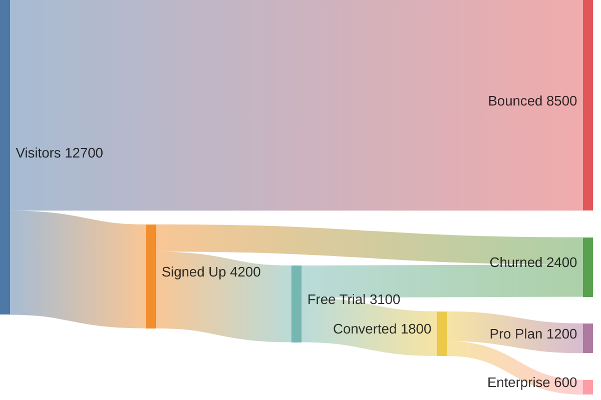
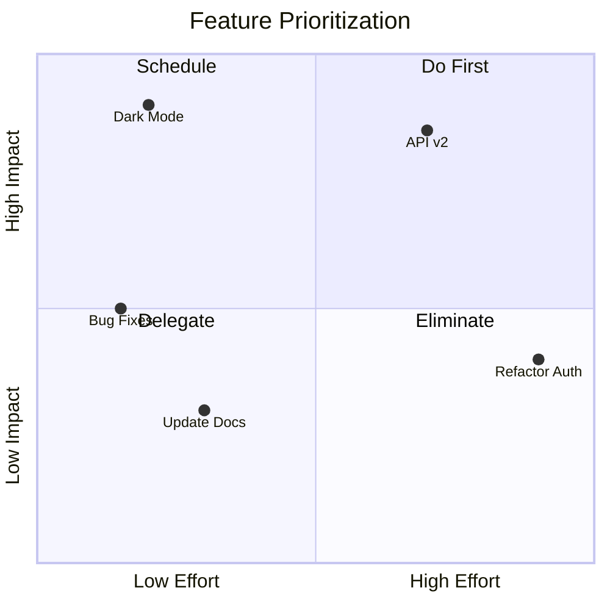
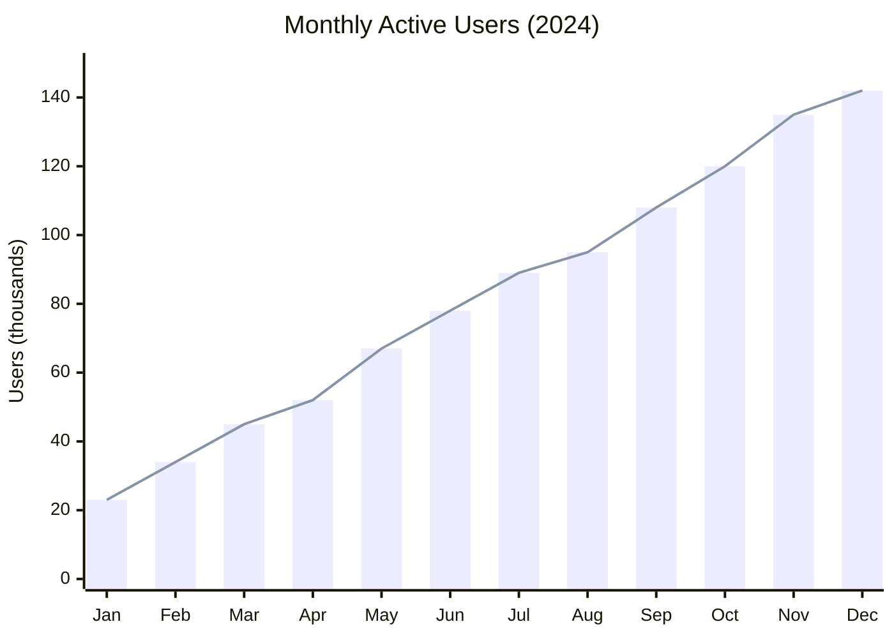

# mermaid-diagrams

Generate Mermaid diagrams in markdown. Claude will automatically use this skill when you ask for diagrams, charts, visualizations, or system documentation.

## Supported diagram types

- Flowcharts
- Sequence diagrams
- Class diagrams
- ER diagrams
- State diagrams
- Gantt charts
- Pie charts
- Mindmaps
- Timelines
- Git graphs
- C4 diagrams
- Quadrant charts
- Sankey diagrams
- XY charts

## Example usage

```
"Create a sequence diagram showing the OAuth flow"
"Draw an ER diagram for a blog database"
"Make a flowchart of the CI/CD pipeline"
```

## Did you know Mermaid can do this?






