# Mermaid Diagram Generation

Generate diagrams using Mermaid syntax within markdown code blocks. Diagrams render automatically in GitHub, GitLab, Obsidian, Notion, and VS Code.

## Quick Start

Wrap diagram code in a fenced code block with `mermaid` language identifier:

````markdown
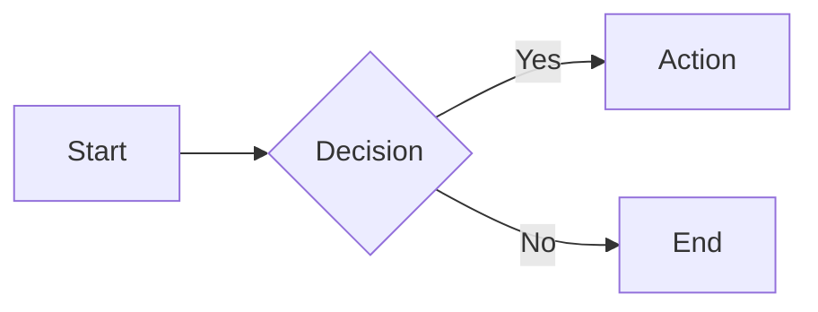
````

## Diagram Types

| Type | Declaration | Use Case |
|------|-------------|----------|
| Flowchart | `flowchart` | Processes, algorithms, decision flows |
| Sequence | `sequenceDiagram` | API calls, service interactions |
| Class | `classDiagram` | OOP structures, type hierarchies |
| ER | `erDiagram` | Database schemas, data models |
| State | `stateDiagram-v2` | State machines, lifecycles |
| Gantt | `gantt` | Project schedules, timelines |
| Pie | `pie` | Distribution, percentages |
| Mindmap | `mindmap` | Brainstorming, hierarchies |
| Timeline | `timeline` | Chronological events |
| Git Graph | `gitGraph` | Branch/merge visualization |

---

## Flowcharts

### Direction

- `TB` / `TD` - Top to bottom
- `BT` - Bottom to top
- `LR` - Left to right
- `RL` - Right to left

### Node Shapes

```
A[Rectangle]       B(Rounded)         C([Stadium])
D[[Subroutine]]    E[(Database)]      F((Circle))
G{Diamond}         H{{Hexagon}}       I[/Parallelogram/]
J[\Parallelogram\] K[/Trapezoid\]     L(((Double Circle)))
```

### Edge Types

```
A --> B       Solid arrow
A --- B       Solid line (no arrow)
A -.-> B      Dotted arrow
A ==> B       Thick arrow
A --o B       Circle end
A --x B       Cross end
A --> |text| B   Arrow with label
```

### Subgraphs

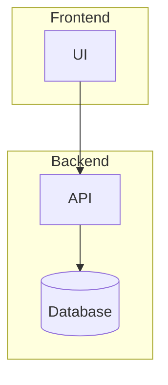

### Example: System Architecture

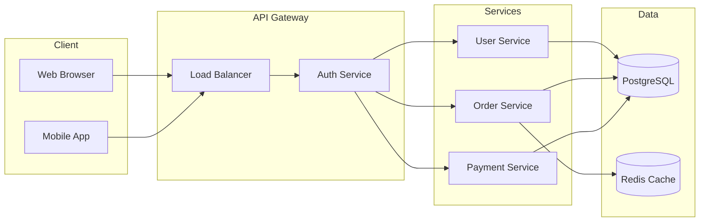

---

## Sequence Diagrams

### Participants

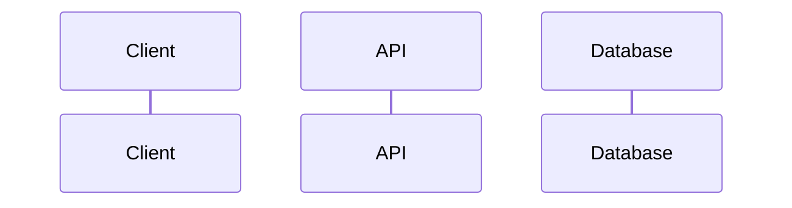

### Message Types

```
A->>B    Solid arrow (sync request)
A-->>B   Dotted arrow (async/response)
A-xB     Cross (failed message)
A-)B     Open arrow (async)
```

### Activation

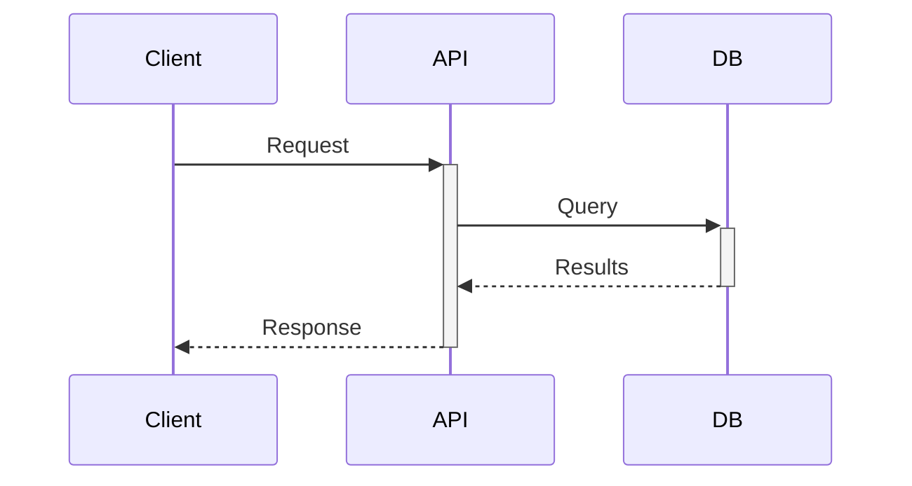

### Control Flow

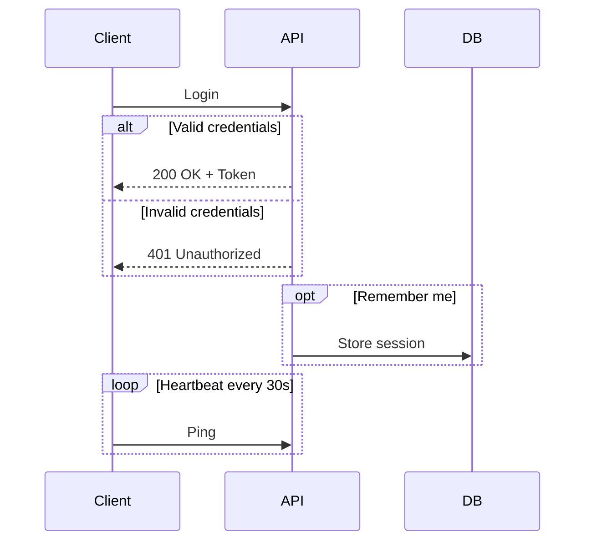

### Notes

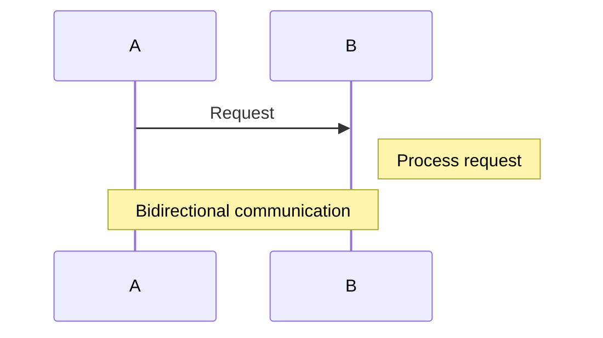

### Example: Authentication Flow

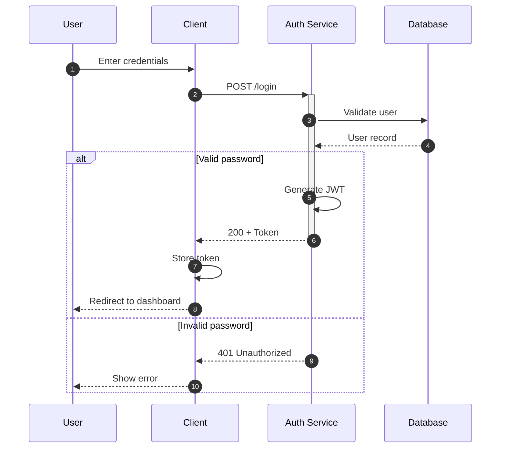

---

## Class Diagrams

### Class Definition

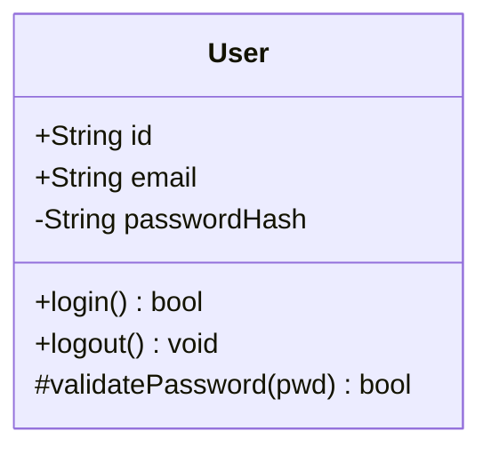

### Visibility Modifiers

- `+` Public
- `-` Private
- `#` Protected
- `~` Package/Internal

### Relationships

```
A <|-- B    Inheritance (B extends A)
A *-- B     Composition (A owns B)
A o-- B     Aggregation (A has B)
A --> B     Association
A ..> B     Dependency
A ..|> B    Realization (implements)
```

### Cardinality

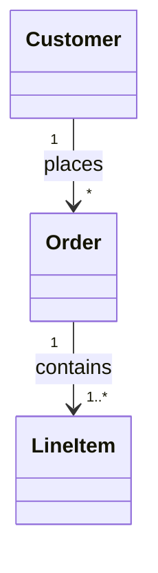

### Example: Domain Model

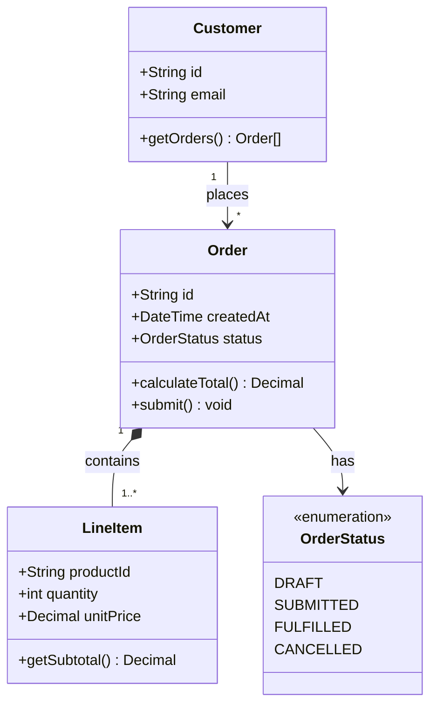

---

## Entity Relationship Diagrams

### Cardinality (Crow's Foot Notation)

```
||--||    One to one
||--o{    One to many
}o--o{    Many to many (optional)
}|--|{    Many to many (required)
```

### Relationship Types

- `--` Identifying (solid line)
- `..` Non-identifying (dashed line)

### Attributes

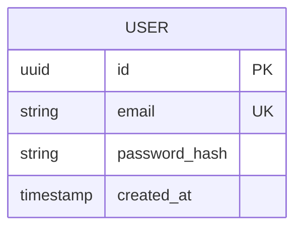

### Example: Database Schema

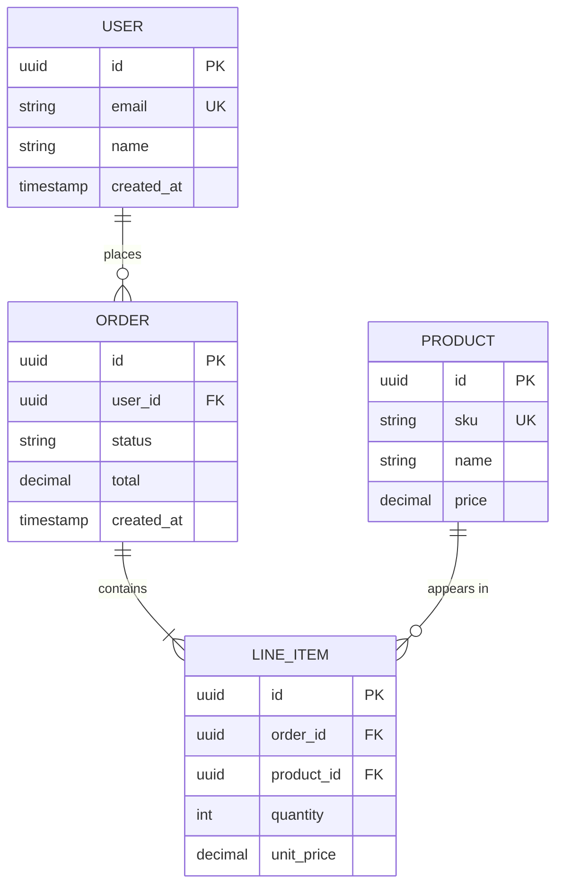

---

## State Diagrams

### Basic States

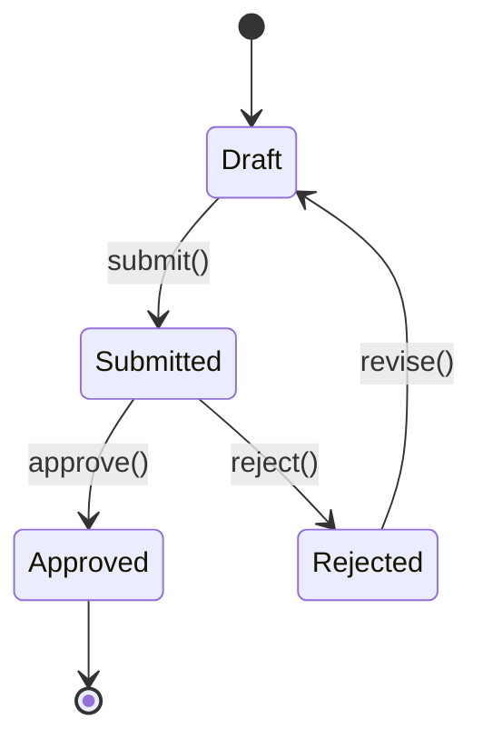

### Composite States

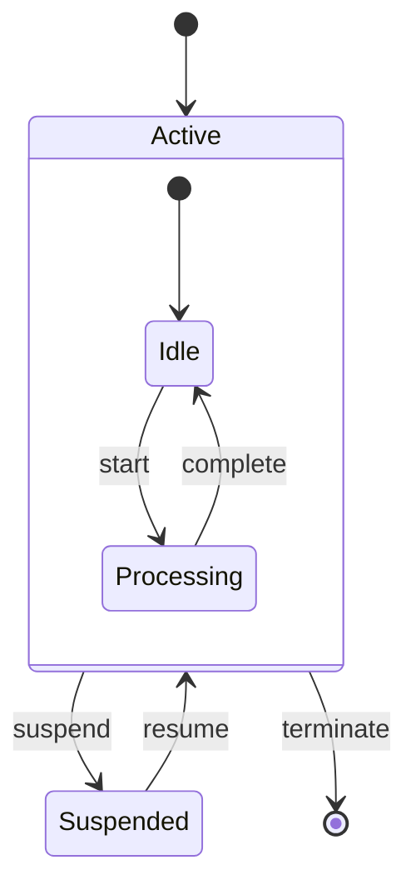

### Choice Points

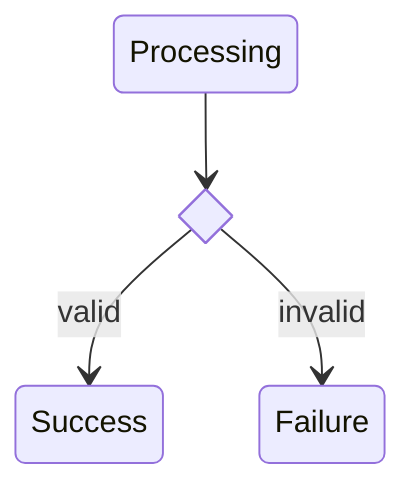

### Fork/Join (Parallel States)

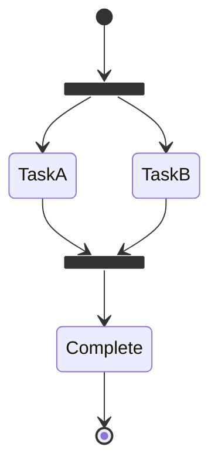

### Example: Order Lifecycle

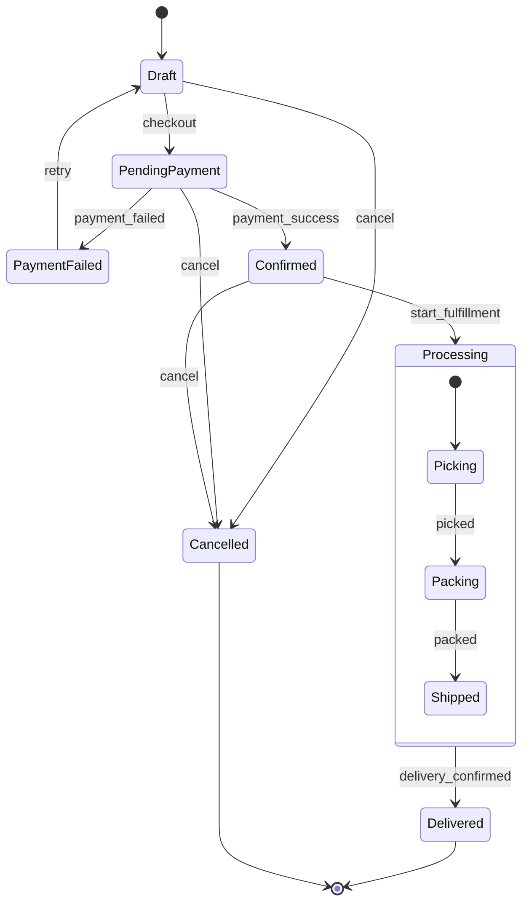

---

## Gantt Charts

### Basic Syntax

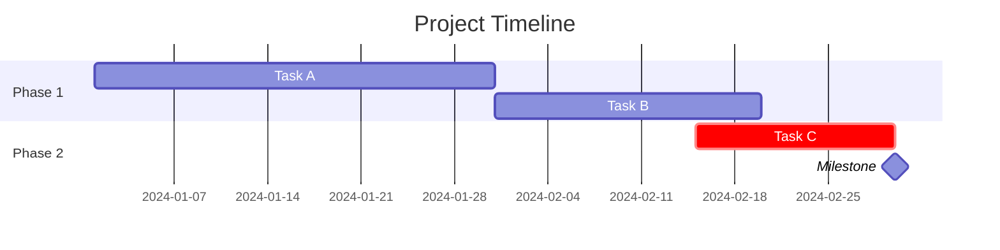

### Task Modifiers

- `crit` - Critical path (red)
- `active` - Currently active
- `done` - Completed
- `milestone` - Milestone marker

### Example: Sprint Plan

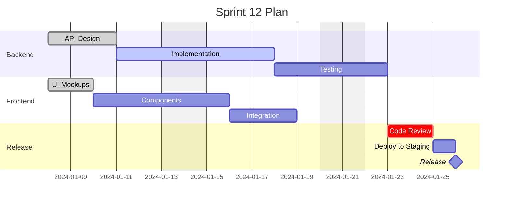

---

## Pie Charts

```mermaid
pie showData
    title Revenue by Region
    "North America" : 42
    "Europe" : 28
    "Asia Pacific" : 20
    "Other" : 10
```

---

## Mindmaps

```mermaid
mindmap
  root((Project))
    Frontend
      React
      TypeScript
      Tailwind
    Backend
      Node.js
      PostgreSQL
      Redis
    Infrastructure
      AWS
      Docker
      Kubernetes
```

---

## Timelines

```mermaid
timeline
    title Product Roadmap
    section Q1
        January : MVP Launch
        February : User Feedback
        March : v1.1 Release
    section Q2
        April : Mobile App Beta
        May : API v2
        June : Enterprise Features
```

---

## Git Graphs

```mermaid
gitGraph
    commit id: "Initial"
    branch develop
    checkout develop
    commit id: "Feature A"
    commit id: "Feature B"
    checkout main
    merge develop id: "v1.0"
    commit id: "Hotfix"
```

---

## Styling

### Theme Configuration

```mermaid
%%{init: {'theme': 'dark'}}%%
flowchart LR
    A --> B
```

Available themes: `default`, `dark`, `forest`, `neutral`, `base`

### Custom Styles

```mermaid
flowchart LR
    A[Start]:::green --> B[Process]:::blue --> C[End]:::green

    classDef green fill:#10b981,stroke:#059669,color:white
    classDef blue fill:#3b82f6,stroke:#2563eb,color:white
```

### Link Styles

```mermaid
flowchart LR
    A --> B --> C
    linkStyle 0 stroke:red,stroke-width:2px
    linkStyle 1 stroke:blue,stroke-width:2px,stroke-dasharray:5
```

---

## Best Practices

1. **Choose the right diagram type** for your data
2. **Keep diagrams focused** - one concept per diagram
3. **Use meaningful labels** - avoid single letters for complex flows
4. **Add direction hints** - LR for timelines, TB for hierarchies
5. **Group related items** in subgraphs or composite states
6. **Use consistent styling** across related diagrams
7. **Test rendering** in your target platform (GitHub, VS Code, etc.)

## Common Patterns

### API Request Flow
Use sequence diagrams with activation bars.

### Database Schema
Use ER diagrams with crow's foot notation.

### System Architecture
Use flowcharts with subgraphs for service boundaries.

### State Machines
Use state diagrams with composite states for complex lifecycles.

### Project Planning
Use Gantt charts with sections and milestones.

### Decision Trees
Use flowcharts with diamond decision nodes.

## Platform Support

| Platform | Support |
|----------|---------|
| GitHub | Native (since 2022) |
| GitLab | Native (13.0+) |
| VS Code | Markdown Preview Mermaid extension |
| Obsidian | Native |
| Notion | Native |
| Confluence | Plugin available |
| Docusaurus | Plugin available |

---

# Advanced Reference

Detailed syntax for advanced Mermaid features.

---

## Flowchart Advanced

### Extended Shapes (v11.3+)

New shape syntax using `@{ shape: shapename }`:

```mermaid
flowchart LR
    doc@{ shape: doc, label: "Document" }
    db@{ shape: cyl, label: "Database" }
    proc@{ shape: rect, label: "Process" }
```

Available shapes: `rect`, `rounded`, `stadium`, `subroutine`, `cyl`, `circle`, `dbl-circ`, `diamond`, `hex`, `lean-r`, `lean-l`, `trap-b`, `trap-t`, `doc`, `notch-rect`, `brace`, `brace-r`, `braces`, `comment`, `bolt`, `lin-cyl`, `bow-rect`, `div-rect`, `odd`, `win-pane`, `f-circ`, `lin-doc`, `tri`, `fork`, `hourglass`, `flag`, `tag-doc`, `tag-rect`, `half-rounded-rect`, `curv-trap`.

### Edge IDs and Animation

```mermaid
flowchart LR
    A e1@--> B e2@--> C
    e1@{ animate: true }
    e2@{ animate: true, animation-duration: "0.5s" }
```

### Markdown in Labels

```mermaid
flowchart LR
    A["`**Bold** and *italic*`"] --> B["`Multi
    line
    text`"]
```

### Icons (FontAwesome)

```mermaid
flowchart LR
    A[fa:fa-user User] --> B[fa:fa-database Database]
```

### Click Events

```mermaid
flowchart LR
    A --> B
    click A href "https://example.com" _blank
    click B call callback()
```

---

## Sequence Diagram Advanced

### Participant Types

```mermaid
sequenceDiagram
    participant U as User
    actor A as Admin
    participant S as Server
```

### Background Highlighting

```mermaid
sequenceDiagram
    rect rgb(200, 220, 255)
    Note over A,B: Highlighted section
    A->>B: Message 1
    B-->>A: Response 1
    end
```

### Parallel Execution

```mermaid
sequenceDiagram
    par Task Group
        A->>B: Task 1
    and
        A->>C: Task 2
    and
        A->>D: Task 3
    end
```

### Critical Sections

```mermaid
sequenceDiagram
    critical Establish connection
        A->>B: Connect
    option Network timeout
        A->>A: Retry
    option Auth failure
        A->>A: Abort
    end
```

### Break on Error

```mermaid
sequenceDiagram
    A->>B: Request
    break Invalid token
        B-->>A: 401 Error
    end
    B->>C: Forward
```

---

## Class Diagram Advanced

### Annotations

```mermaid
classDiagram
    class Service {
        <<interface>>
        +handle() void
    }

    class UserService {
        <<service>>
    }

    class Config {
        <<enumeration>>
        DEV
        PROD
    }
```

### Generic Types

```mermaid
classDiagram
    class Repository~T~ {
        +find(id) T
        +save(entity: T) void
    }

    Repository~User~ <|-- UserRepository
```

### Notes

```mermaid
classDiagram
    class User
    note for User "Core domain entity"
```

### Namespace

```mermaid
classDiagram
    namespace Domain {
        class User
        class Order
    }
    namespace Infrastructure {
        class Repository
    }
```

---

## ER Diagram Advanced

### Attribute Modifiers

```mermaid
erDiagram
    USER {
        uuid id PK "Primary key"
        string email UK "Must be unique"
        uuid org_id FK "References organization"
        string name "User's display name"
    }
```

### Derived Attributes

Use comments to indicate derived/computed fields:

```mermaid
erDiagram
    ORDER {
        uuid id PK
        decimal subtotal
        decimal tax
        decimal total "Computed: subtotal + tax"
    }
```

---

## State Diagram Advanced

### Notes

```mermaid
stateDiagram-v2
    Active --> Processing
    note right of Active
        This is the initial state
    end note
```

### Direction

```mermaid
stateDiagram-v2
    direction LR
    [*] --> A
    A --> B
    B --> [*]
```

### Concurrency

```mermaid
stateDiagram-v2
    state Composite {
        [*] --> A
        --
        [*] --> B
    }
```

---

## Gantt Advanced

### Date Formats

```
dateFormat YYYY-MM-DD     Default
dateFormat DD/MM/YYYY     European
dateFormat MM-DD-YYYY     US
```

### Axis Format

```mermaid
gantt
    dateFormat YYYY-MM-DD
    axisFormat %b %d
    section Project
    Task A : 2024-01-01, 14d
    Task B : 2024-01-15, 10d
```

### Excluding Days

```mermaid
gantt
    dateFormat YYYY-MM-DD
    excludes weekends
    excludes 2024-12-25
    section Sprint
    Development : 2024-12-16, 14d
    Testing     : 2024-12-30, 7d
```

### Vertical Markers

```mermaid
gantt
    title With Deadline
    dateFormat YYYY-MM-DD

    Task 1 : 2024-01-01, 30d
    Deadline : vert, 2024-01-15
```

### Task Dependencies

```
after taskId         Start after task
after taskId1 taskId2    After multiple tasks
```

---

## Configuration

### Init Directive

```mermaid
%%{init: {
  'theme': 'base',
  'themeVariables': {
    'primaryColor': '#3b82f6',
    'primaryTextColor': '#fff',
    'primaryBorderColor': '#2563eb',
    'lineColor': '#64748b',
    'secondaryColor': '#10b981',
    'tertiaryColor': '#f1f5f9'
  }
}}%%
flowchart LR
    A --> B
```

### Theme Variables

| Variable | Description |
|----------|-------------|
| `primaryColor` | Main node color |
| `primaryTextColor` | Text in primary nodes |
| `primaryBorderColor` | Border of primary nodes |
| `lineColor` | Edge/arrow color |
| `secondaryColor` | Secondary elements |
| `tertiaryColor` | Background/tertiary |
| `fontSize` | Base font size |
| `fontFamily` | Font family |

### Security Level

```mermaid
%%{init: { 'securityLevel': 'loose' }}%%
flowchart LR
    A --> B
```

Levels: `strict`, `loose`, `antiscript`, `sandbox`

---

## Troubleshooting

### Special Characters

Escape with HTML entities or quotes:

```mermaid
flowchart LR
    A["Node with #quot;quotes#quot;"]
    B["Arrow -> symbol"]
```

### Common Escapes

| Char | Entity |
|------|--------|
| `#` | `#35;` |
| `"` | `#quot;` |
| `<` | `#lt;` |
| `>` | `#gt;` |

### Long Labels

Use markdown strings with backticks for wrapping:

```mermaid
flowchart LR
    A["`This is a very long
    label that wraps`"]
```

### Rendering Issues

1. Check for unclosed brackets/quotes
2. Verify arrow syntax matches diagram type
3. Test in Mermaid Live Editor: https://mermaid.live
4. Check platform-specific limitations

---

## C4 Diagrams

For software architecture using C4 model:

```mermaid
C4Context
    title System Context
    Person(user, "User", "A user of the system")
    System(system, "System", "Main application")
    System_Ext(ext, "External System", "Third party")

    Rel(user, system, "Uses")
    Rel(system, ext, "Calls API")
```

---

## Quadrant Chart

```mermaid
quadrantChart
    title Product Priority Matrix
    x-axis Low Effort --> High Effort
    y-axis Low Impact --> High Impact
    quadrant-1 Quick wins
    quadrant-2 Major projects
    quadrant-3 Fill-ins
    quadrant-4 Thankless tasks
    Feature A: [0.3, 0.8]
    Feature B: [0.8, 0.9]
    Feature C: [0.2, 0.2]
```

---

## Sankey Diagram

```mermaid
sankey-beta
    Source A, Target X, 25
    Source A, Target Y, 15
    Source B, Target X, 10
    Source B, Target Z, 20
```

---

## XY Chart

```mermaid
xychart-beta
    title "Sales Trend"
    x-axis [jan, feb, mar, apr, may]
    y-axis "Revenue (thousands)" 0 --> 100
    bar [52, 58, 63, 71, 82]
    line [52, 58, 63, 71, 82]
```
